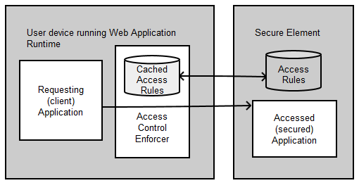

# SE API: Access Control Proposal

This documents describes why the [Secure Element API](http://opoto.github.io/secure-element) has to be protected, and how the GlobalPlatform specification can address this requirement.

## Objectives

The Secure Element API defines a way to interact with secure elements. Although these secure elements embed many security protections (such as requiring user to present a PIN to unlock access, or secure messaging providing authenticated and encrypted communications), access to the secure elements should not be accessible to any application, because:

 * Applications may perform denial of service (DoS) attacks, e.g. by deliberately presenting invalid PIN values to block the secure element, or sending burst of commands preventing legitimate applications to execute optimally.

 * Some secure element operations or data may be accessible without restrictions, based on the assumption that the user will only present the secure element to a trusted party. In the context of web OS or multi-tab web browsers, a user may have multiple web applications running simultaneously on her/his device. There has to be a mean to allow access to a single selected, trusted, web application, while blocking access to the others. The threat is here disclosure of personal - though not confidential - information to improper recipient.

To prevent such scenario, access to the Secure Element API must be restricted to authorized applications. Although asking for user consent permits to selectively grant access to applications, it does not provide a sufficient level of security: users are not informed enough to know when to consent or refuse, and tend to consent to anything applications ask.

## GlobalPlatform Access Control

GlobalPlatform defines a standard mechanism to control which applications on a user device are allowed to access secure element applications. It is based on the following principles:

 * The secure element hosts a list of Access Rules. An access rule defines the Application Identifier (AID) of the secure element application to control access to, and the identifier of the requesting application running on the device, as well as a filter on authorized APDUs, or a simple boolean to authorize all or no communications.

 * An Access Control Enforcer is running on the device of the client application. Any tentative to establish a communication with a secure element application from this device will trigger this enforcer, which will query the secure element to get the access rules (and usually cache them), and check that the requesting application is authorized to communicate with the secure element.

*Overview of the GlobalPaltform access control architecture*

This GlobalPlatform specification defines a simple mechanism that protects legitimate users using non-compromised devices from malicious applications. Note that it does not protect from a compromised device that would not properly implement the Access Control Enforcer, which is out of scope of our objectives, and is addressed by the internal protection of the secure element itself (PIN, secure messaging, etc.)

Further documentation:

 * The **Secure Element Access Control** specification is freely available here:
    [GlobalPatform specification](http://www.globalplatform.org/specificationsdevice.asp)

 * A brief overview, related to an Android implementation, can be found here:
    [Access Control in Seek-for-Android](https://code.google.com/p/seek-for-android/wiki/AccessControlIntroduction)

## SE API proposal

### Applicability of GlobalPlatform Access Control

The GlobalPlatform access control mechanism presented above meets the objectives we identified to protect access to the Secure Element API. It can be implemented by the web execution runtime given that web applications have a unique and verifiable application identifier.

GlobalPlatform considers two types of application identifiers, depending on the application execution environment:
 
 * Device execution environment which supports device applications signed with a key of the application provider. In this case, device applications are provided (i.e. in the application container) with a certificate of the Application Provider. This certificate is verified by the application installer of the Execution Environment. This certificate will be used by the Access Control Enforcer as the identifier to retrieve the access rule that is applicable for this device application. This is typically the case of Rich Execution Environment (REE) such as Android or Windows Phone 8.

 * Device execution environment on which device applications are uniquely identified with an application identifier which is included in the application and cannot be forged. This identifier will be used by the Access Control Enforcer to retrieve the access rule that is applicable for this device application. This is typically the case of the Trusted Execution Environment (TEE), where Trusted Applications (TAs) are uniquely identified by their UUID.

Although URLs maybe be considered as unique identifiers for common Web applications (and especially HTTPS URLs), the [app URI scheme](http://www.w3.org/2012/sysapps/app-uri/) used by packaged web application do not meet the requirement to be unique and verifiable: the authority part of the URI can not be enforced by the application issuer. We hence rely on a signature of the web application, and use the signing certificate as the identifier to retrieve the access control rule:

 * A web application accessing the Secure Element API needs to present a signature issued by its application provider. This signature can be provided as the [author signature](http://www.w3.org/TR/widgets-digsig/#author-signatures) defined in W3C [XML Digital Signatures for Widgets](http://www.w3.org/TR/widgets-digsig/). This signature is encoded in an XML file, deployed with the web application (either as a resource of the packaged application, or an online resource for hosted application).

 * The location from which this signature can be fetched is set in a dedicated field in the application manifest:
 The ``author-signature-url`` field of the manifest is a string holding the path, relative to the manifest file, to the author signature file. If this field is absent, the user agent will use the default *"author-signature.xml"* relative path.

 * Depending on the application type, the signature signs:
   * For packaged applications: the exhaustive list of the packaged application resources, excluding the signature file itself.
   * For hosted applications: an absolute URI representing the web application's top URL in the URI hierarchy. All application resources, including the manifest file, MUST be located hierarchically below this URI. Consequently, any resource which URL is not hierarchically below this URI will not be considered part of this application, and hence not eligible to benefit from its potentially granted access to the Secure Element API.

 * The certificate used for computing the author signature may be self-signed. This certificate, and the certificates part of its issuance chain, if any, MUST be valid: 
    * the current date MUST be inside the certificate validity dates;
    * the certificate signature MUST be valid;
    * If a revocation endpoint is set in the certificate, the runtime MUST use it to check this certificate is not revoked.

 * The hash of the certificate used to generate this author signature will be used as the input for the access control verification process, following the GlobalPlatform Access Control process defined for Rich Execution Environment.

While applying the GlobalPlatform Access Control process, if the Access Control Enforcer detects the Secure Element does not implement the GlobalPlatform Access Control (it does not have access rules), the Access Control Enforcer may use its own certificate trust store to grant or refuse access to the Secure Element API.

### Additional security restrictions

Because the author signature does not sign the full list of resources for hosted web applications, the origin and integrity of these resources must be guaranteed using the following security restriction:

 * To be eligible to gain access to the Secure Element API, a hosted web application MUST be fetched using HTTPS protocol.

 * The SSL/TLS server certificate of this HTTPS connection MUST be valid:
   * the certificate subject MUST match the hosting domain name
   * the certificate validity dates MUST include the current date
   * the certificate chain MUST be valid (signature chain) and rooted by a trusted CA   

 * The user MUST not be able to bypass these rules. Some browsers offer users to define "exceptions" to allow connections to a HTTPS URL even if SSL server certificate is invalid. Such exception MUST not be used to allow access to the Secure Element API.

### Impact on the W3C Secure Element API

In order to use the access control as described above, the following changes have to be made to the [Secure Element API](http://opoto.github.io/secure-element):

 * A new "access control" section must be added, stating that the implementation of the Secure Element API must implement the access control as defined above (with references to GlobalPlatform specifications)

 * A new `SEError` value : `unauthorized` must be defined, that will be triggered when an operation is blocked by an access control rule

 * In each SE API operation description, the access control will be documented in the algorithm to define when and how it will impact the operation processing.
